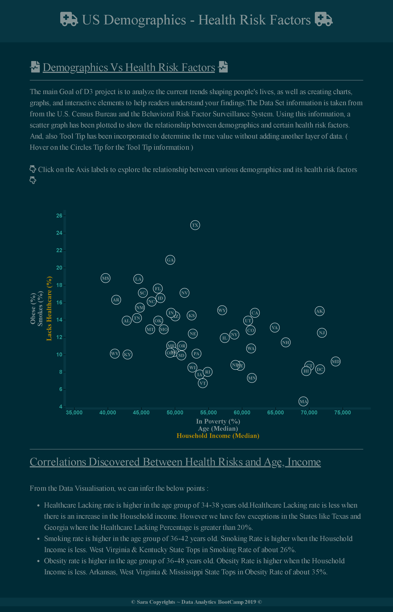

# US Demographics  - Health Risk Factors

The main Goal of D3 project is to analyze the current trends shaping people's lives, as well as creating charts, graphs, and interactive elements to help readers understand your findings.The Data Set information is taken from from the U.S. Census Bureau and the Behavioral Risk Factor Surveillance System. Using this information, a scatter graph has been plotted to show the relationship between demographics and certain health risk factors. And, also Tool Tip has been incorporated to determine the true value without adding another layer of data. 

## Final Look of the Website

### Demographics Vs Health Risk Factors

<h2><u>Correlations Discovered Between Health Risks and Age, Income</u></h2> 
		  
 From the Data Visualisation, we can infer the below points : 
 
		  <ul>
		  <li>Healthcare Lacking rate is higher in the age group of 34-38 years old.Healthcare Lacking rate is less when there is an increase in the Household income. However we have few exceptions in the States like Texas and Georgia where the Healthcare Lacking Percentage is greater than 20%.</li>
		  <li>Smoking rate is higher in the age group of 36-42 years old. Smoking Rate is higher when the Household Income is less. West Virginia & Kentucky State Tops in Smoking Rate of about 26%.</li>
		  <li>Obesity rate is higher in the age group of 36-48 years old. Obesity Rate is higher when the Household Income is less. Arkansas, West Virginia & Mississippi State Tops in Obesity Rate of about 35%. </li>
		  </ul>
